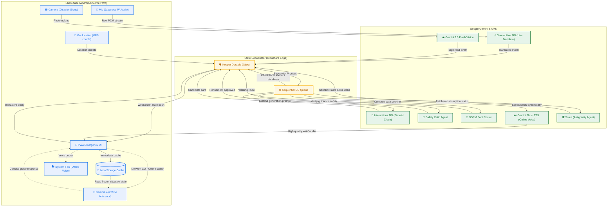

# 🛡️ AEGIS — Tokyo Earthquake Survival Companion

> **"Forgets the second the task ends — build one that can't."**  
> AEGIS is a stateful emergency companion for foreign travelers caught in a Tokyo earthquake. It translates chaotic announcements live (**Gemini Live Translate**), holds the traveler's evolving situation statefully (**Interactions API**), crawls live regional disruptions via a Google-hosted Linux container (**Antigravity agent**), and—when the network dies—hands its memory to the phone where **Gemma 4** keeps guiding them completely offline.

---

## 🎯 Hackathon Rubric Alignment

| DeepMind Hackathon Metric | AEGIS Technical Implementation | Architecture Role |
| :--- | :--- | :--- |
| 🛡️ **"Build one that can't forget"** | Stateful backend Situation Object persists history via the **Interactions API** (`previous_interaction_id`), while the PWA caches every push in browser storage (`localStorage`) to survive network cuts. | Stateful Coordinator & Edge Cache |
| 🕵️ **"Resuming via environment ID"** | The **Antigravity Scout** sandbox is provisioned once (`environment: "remote"`) and statefully resumed each cycle by passing back the same `environment_id` string to crawl staged Metro/Shelter status pages. | Stateful Disruption Web Crawler |
| 🗣️ **"Live Translate API"** | Streams raw Japanese station announcements into `gemini-2.5-flash` Live API's translation config to output English transcripts in real-time. | Real-Time Voice Translation Input |
| 🔗 **"Second primitive fires because first ran"** | The offline **Gemma 4** inference can only guide the user because the online **Interactions API** phase continuously updated and serialized the Situation Object to the phone prior to signal loss. | Online-to-Offline Handoff |

---

## 📐 System Architecture

The AEGIS architecture is built on a **flat, event-driven topology** where a single coordinator controls all state writes, keeping the frontend client-side code completely secure and keyless.



---

## 📂 Repository Map

```
├── keeper/             # Cloudflare Worker + Durable Object state coordinator (The ONE Writer)
│   └── src/index.js    # Durable Object queue logic, reverse geocoding, and OSRM routing
├── app/                # PWA frontend React 18 application source code (Leaflet + Speech Recognition)
├── public/             # PWA build output, service worker, static shelter data, and staged HTML files
│   ├── sw.js           # Service worker (handles offline assets caching)
│   └── staged/         # Staged metropolitan HTML pages crawled by the Scout Antigravity agent
├── workers/            # AI Background Worker Scripts (emit events to Keeper DO)
│   ├── listener/       # listener.mjs: Streams PCM audio to Gemini Live Translate
│   ├── scout/          # scout.mjs: Web disruption scraper using Antigravity sandboxed agent
│   └── auditor/        # auditor.mjs: Independent auditor agent loops for QA verification
├── assets/             # Test PCM audio clips, coordinates database, and sign images
└── scripts/            # Sandbox launchers and evaluation testing tools
    ├── start-local.sh  # Script to launch Wrangler DO and Vite React servers simultaneously
    └── harness-loop.mjs# Rehearsal event driver that evaluates health invariants on each step
```

---

## ⚡ Setup Guide (~15 Minutes)

### 1. Requirements
Ensure you have **Node.js (v20 or higher)** installed on your machine.

### 2. Install Project Dependencies
Run install in each directory:
```bash
# Keeper backend
cd keeper && npm install && cd ..

# App frontend
cd app && npm install && cd ..

# Background workers
cd workers && npm install && cd ..
```

### 3. Configure Gemini API Key
Obtain a Google AI Studio API Key and save it in a `.dev.vars` file for the local Cloudflare Wrangler dev server:
```bash
echo "GEMINI_API_KEY=your_gemini_api_key_here" > keeper/.dev.vars
```

### 4. Download Gemma 4 (Web Inference Model)
Run the script to download the ~1.3GB MediaPipe/LiteRT task file. 
```bash
node scripts/download-model.mjs
```
> [!TIP]
> * **Local Development**: Vite is preconfigured to serve this model directly from the root `models/` directory.
> * **Production Deployment**: Copy the downloaded model into the `public/models` directory so Wrangler uploads it as a static asset:
>   `mkdir -p public/models && cp models/gemma-4-E2B-it-web.task public/models/`

---

## 🚀 Running the Local Dev Sandbox

Run the launcher script to start the local Wrangler Durable Objects server (port `8787`) and Vite React frontend (port `5180`):
```bash
./start-local.sh
```
Open **`http://localhost:5180`** in your browser.

---

## 🎬 Rehearsal & Live Demo Guide

To simulate the emergency timeline during presentations, you can trigger events using these utilities:

### Step 1: Pre-stage Maria's region (Arrival)
Open the app at `http://localhost:5180`, go to the **Privacy** tab, and enter `Shinjuku` as the location.
* **Server-side effect**: The Keeper DO reverse-geocodes Shinjuku, queries Google Maps for public evacuation shelters/hospitals, and caches them in Durable Object storage.
* **UI effect**: Watch the **Agent Ops** panel in the footer log: `Entered Shinjuku — pre-staging region for offline` -> `Pre-cached 8 shelters... ready offline`. This pre-caching slashes the time-to-route from 40s to ~8s when disaster strikes.

### Step 2: Fire the Earthquake
Trigger the disaster alert in the sandbox. You can do this by **long-pressing the "Monitoring" brand pill** in the app header, or executing:
```bash
curl -X POST 'http://localhost:8787/event?session=demo' -H "Content-Type: application/json" -d '{"type":"quake","payload":{"magnitude":"5+"}}'
```
* **UI effect**: A red full-screen alert triggers, the map centers on Shinjuku station, and high-contrast guidance cards appear.

### Step 3: Stream Live Translated Broadcasts
Simulate the station PA broadcasting in Japanese. In a separate terminal:
```bash
export GEMINI_API_KEY=your_gemini_api_key_here KEEPER_URL=http://localhost:8787
node workers/listener/listener.mjs assets/pa2.pcm
```
* **UI effect**: The PWA displays the translated station warnings ("Elevator suspended. Avoid stairs. Use west concourse ramp") and **expressively voices them in English** using Gemini TTS.

### Step 4: Resume Antigravity Scout Web Sandbox
To fetch the latest metro exit blockages and official evac directions crawled from live staged pages:
```bash
node workers/scout/scout.mjs
```
* **UI effect**: The Scout worker resumes its remote environment using the stored `environment_id`. OSRM Router immediately updates the step-free walking route polyline avoiding closed stairs and targeting Shinjuku Chuo Park.

### Step 5: Test the Critic & Independent Auditor
* **Critic**: When the Generator proposes instructions, a Critic model checks it against the user's constraints (`no_stairs`). Re-run `node workers/scout/scout.mjs` and watch Agent Ops show the critic loop verifying safety invariants.
* **Auditor**: Run `node workers/auditor/auditor.mjs --loop` to launch the independent QA reviewer. It evaluates the current guidance safety every 15s and updates the green QA badge on the client.

### Step 6: Simulate Signal Loss (Offline Takeover)
Go to the **Privacy** tab and tap **Simulate signal loss (tunnel)**. The app switches to offline mode:
1. Tap the **Voice** mic button.
2. Ask: *"Where is the nearest shelter?"* or *"My child is hurt, what should I do?"*
* **UI effect**: **Gemma 4** runs locally on the browser to output survival advice using the cached Situation Object in `localStorage`, voiced aloud by the device's system TTS.

---

## 🔒 Security & Architecture Moats

1. **Zero Client-Side API Keys**: Because online calls are routed through the Cloudflare Worker DO (where secrets are kept), client applications expose zero private keys. Offline inference runs a locally compiled MediaPipe file, which is inherently keyless.
2. **Actor-Based Race Protection**: Standard Cloudflare Workers can experience race conditions when multiple events arrive simultaneously. AEGIS uses a sequential queue (`this.queue`) inside the Durable Object to serialize writes, enforcing a strict single-writer model.
3. **Double-Agent Verification**: Every generative card has a two-pass architecture. The **Generator** proposes instructions, and a **Critic** verifies safety constraints. If the Critic rejects the instruction (e.g., if it attempts to route a wheelchair user via stairs), it invokes the Interactions API chain to automatically refine the instruction.
