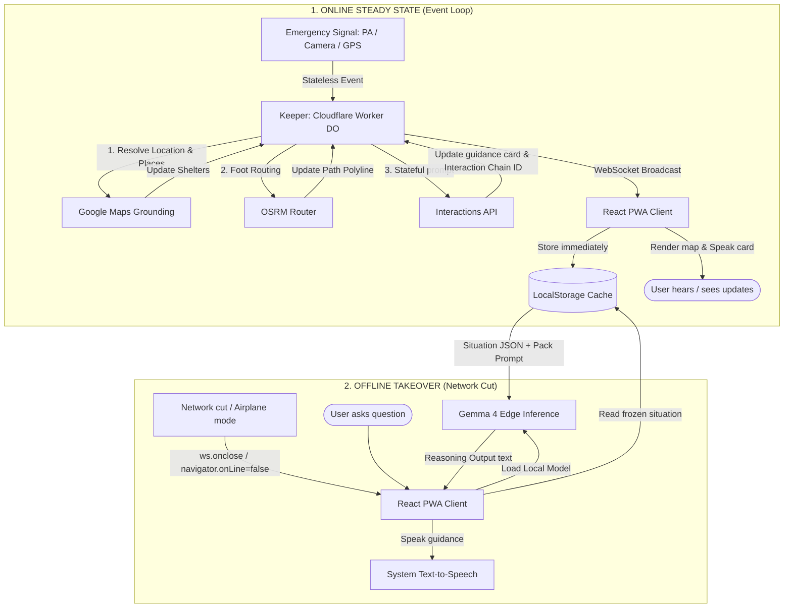

# AEGIS — Technical Documentation

This guide provides the complete architectural map, workflows, stack justifications, and defense armor to answer any technical or product questions about the AEGIS Tokyo Earthquake Survival Companion.

---

## 1. Statement Four Rubric Mapping

To defend the project to Google DeepMind judges, use these mappings:

| Rubric Requirement | AEGIS Implementation | Technical Justification |
| :--- | :--- | :--- |
| **"Forgets the second the task ends — build one that can't"** | Stateful server chain + offline phone caching. | The server-side Situation Object persists history via the **Interactions API** (`previous_interaction_id`), while the PWA caches every push in browser storage (`localStorage`) to survive network cuts. |
| **"Holding state across a long task... resuming via environment ID"** | Antigravity Scout loop. | The **Antigravity agent** sandbox is provisioned once (`environment: "remote"`) and resumed each cycle by passing back the same `environment_id` to crawl staged pages from the same Linux container. |
| **"Talking across languages... through Live Translate"** | `gemini-3.5-live-translate-preview` | Streams raw Japanese PA audio in, transcribing and translating it to the user's language in real time to form the primary system input. |
| **"Second primitive fires only because first is running"** | Stateful online-to-offline handoff. | The offline **Gemma 4** inference can only guide the user because the online **Interactions API** phase continuously updated and serialized the Situation Object to the phone prior to signal loss. |

---

## 2. System Architecture & The "One Writer" Law

AEGIS operates on a **flat, event-driven topology** where the coordinator holds all state. 

```
                          MARIA'S ANDROID/CHROME PWA
   ┌───────────────────────────────────────────────────────────────────────┐
   │ Mic (PA Audio) ──► Camera (Signs) ──► Geolocation (GPS)               │
   │                                                                       │
   │ Local Storage ◄─── WebSocket Pushes ◄─── Offline Takeover (Gemma 4)   │
   └───────┬───────────────────▲───────────────────────────────▲───────────┘
           │                   │                               │
           ▼ (Events)          │ (Situation Object)            │ (Network Cut)
   ┌───────────────────────────┴───────────────────────────────┴───────────┐
   │                   KEEPER (Cloudflare Worker DO)                       │
   │  • Enforces sequential execution queue (no race conditions)           │
   │  • Triggers parallel agents: Listener, Scout, Maps, OSRM Router       │
   │  • Statefully prompts the Interactions API                            │
   └───────┬───────────────────┬───────────────────────────────┬───────────┘
           ▼                   ▼                               ▼
    GEMINI LIVE API     INTERACTIONS API                ANTIGRAVITY AGENT
    (Live Translate)    (Keeper Reasoning)              (Scout Web Sandbox)
```

### The Single-Writer Law
* **The Rule:** Only the **Keeper (Durable Object)** is allowed to write to the Situation Object. 
* **The Reason:** Preventing state corruption at 3 a.m. Workers (Listener, Eyes, Scout, GPS) are entirely stateless; they only emit structured JSON events to `/event` or the WebSocket.
* **DO Queue Pattern:** Durable Objects interleave concurrent requests at `await` points. The Keeper resolves this by queuing all event handlers sequentially (`this.queue = this.queue.then(...)`) to guarantee write integrity.

### The Situation Object (JSON Schema Contract)
```json
{
  "session_id": "aegis-maria-001",
  "interaction_chain_id": "itx_...", // Proof of stateful Interactions API
  "scout_environment_id": "env_...", // Proof of Antigravity sandbox
  "user": {
    "name": "Maria",
    "language": "en",
    "constraints": ["child_age_6", "no_stairs"],
    "location": { "lat": 35.68, "lng": 139.70, "source": "device_gps" }
  },
  "event": { "type": "earthquake", "magnitude_reported": "5+", "t0": "..." },
  "environment": [ // Translated PA announcements + sign reads
    { "src": "PA", "ja": "...", "en": "...", "t": "..." }
  ],
  "live_delta": { // Live crawled data from Scout
    "exits_down": ["east", "south_stairs"],
    "official_evac_direction": "west_concourse",
    "shelters": [ { "name": "Shinjuku Park", "dist_m": 600, "step_free": true, "capacity": "open" } ]
  },
  "route": { "target": "...", "distance_m": 600, "coords": [[35.68, 139.70]], "first_step": "..." },
  "guidance": { "current_instruction_en": "...", "next_question": "...", "needs_tap": true },
  "audit": { "status": "pass", "checks": [] }, // Quality checks from Auditor agent
  "agents": [ { "agent": "Scout", "status": "done", "detail": "..." } ] // Control room log
}
```

---

## 3. Technology Stack & Justifications

| Component | Stack Selection | Engineering Justification |
| :--- | :--- | :--- |
| **Backend & Coordinator** | Cloudflare Worker + Durable Object | Single-threaded actor model prevents write race conditions for free. Deploys edge assets (PWA) on the same worker, eliminating cross-origin issues. |
| **PWA Client** | React 18 + Vite | Premium UI components with fast state mapping. Built-in Vite proxy relays WebSocket and API requests seamlessly during local development. |
| **Online Routing** | Open Source Routing Machine (OSRM) | Computes walking routes along real roads/street networks dynamically without needing an external commercial API key. |
| **Map Rendering** | Leaflet + CartoDB Dark Tiles | Clean vector layer. Leaflet circle markers scale smoothly. CartoDB dark mode matches the premium, high-contrast disaster tool design. |
| **Offline Map Caching** | Service Worker + CacheStorage | Intercepts geolocation changes on-device. Warping to a new area (>1.5km) triggers `prepareRegion()` to pre-fetch and store map tiles offline. |
| **Offline Inference** | Gemma 4 E2B via MediaPipe GenAI | The E2B `.task` model (~1.9GB) runs locally in Chrome via Web Assembly. Completely bypasses network dependencies when signal drops. |
| **Offline Audio / Voice** | Web Speech API (System TTS) | Gemma 4 is text-output only. Web Speech API synthesis provides low-latency voice narration using the device's native English TTS engine. |

---

## 4. Operational Workflows



### Online Steady State
1. **Event Ingest:** A worker emits an event (e.g. `{ type: "quake" }`).
2. **Keeper Queue:** The Durable Object queues the event, reverse-geocodes coordinates, and queries Google Maps for nearby shelters.
3. **OSRM Route:** Evaluates the nearest **open, step-free** shelter and calculates the road distance/polyline.
4. **Interactions Prompt:** Prompts `gemini-3.5-flash` with the situation state to produce a concise guidance card (e.g., citing route details).
5. **Real-time Push:** The DO serializes the Situation Object and broadcasts it to all active WebSockets.

### The Handoff Trick
We **never** attempt to serialize state in real time during a network drop. 
Instead, **the client caches every Situation Object update to `localStorage` as it arrives**. When the WebSocket connection is lost (`ws.onclose` / `navigator.onLine === false`), the handoff is a boring local read. The client reads the cache, flips to offline mode, and instantiates Gemma 4.

### Offline Takeover
1. The user asks a question offline.
2. The query is combined with the frozen `localStorage` state and sent to the local Gemma 4 instance.
3. **Offline Prompt Constraints:** Instructions tell Gemma to reason *only* over the frozen data, warn the user about data age, and never invent access features.
4. Output is rendered on screen and voiced via system TTS.

---

## 5. Judge & VC Q&A Armor

### Technical Judge Q&A
* **"Why not just Google Maps offline + J-Alert?"**
  * *Answer:* J-Alert is broad. Google Maps is static. Neither knows that the user is carrying a child (no stairs), nor can they read a handwritten Japanese sign, translate station PA audio in real time, and compute a dynamic route based on live-crawled closed exits.
* **"Why a multi-agent swarm instead of a single prompt?"**
  * *Answer:* Concurrency and independence. The PA listener, sign vision, and web scout run in parallel. A single serial prompt cannot look, listen, and crawl concurrently against a closing connection window.
* **"What stops Gemma from hallucinating a safe route offline?"**
  * *Answer:* Architectural constraints. The offline prompt strictly forbids Gemma from routing via any exit or shelter not explicitly listed in the cached Situation Object. 

### VC Q&A (Product & Market)
* **"Who is the customer and how do you make money?"**
  * *Answer:* B2B travel insurers and enterprises with Duty of Care obligations (e.g., protecting staff traveling abroad). Insurers license the coordinator software per seat to safeguard policyholders during natural disasters.
* **"What is the moat? Google could build this."**
  * *Answer:* Google builds primitives (Live Translate, Gemma, Antigravity). We build the system integration, vertical connectors (embassy registries, travel insurance APIs), and cached-handoff architecture that solves the last-mile connectivity drop.
* **"Why now?"**
  * *Answer:* This project relies on three Google models/features that only became available recently: real-time streaming Live Translate, stateful Interactions API chains, and browser-runnable Gemma 4 models.
